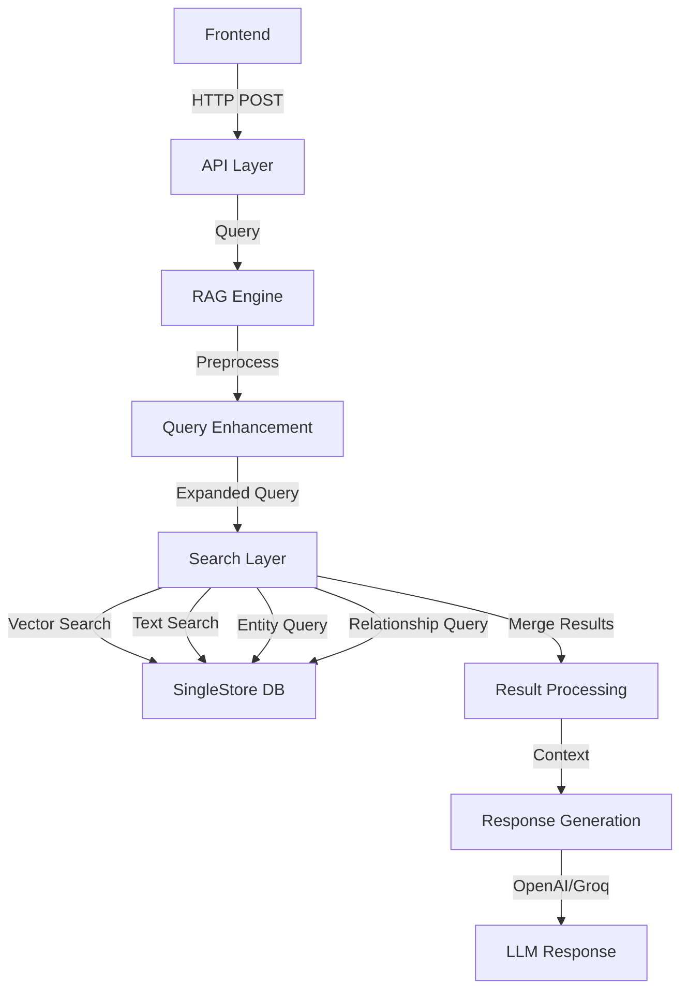

# SingleStore Knowledge Graph Search: Retrieval Flow

This document outlines the complete retrieval flow of the SingleStore Knowledge Graph Search system, from query input to response generation.

## High-Level Architecture



## Detailed Flow

### 1. Frontend Query Submission
**Location**: `frontend/components/SearchForm.tsx`
- User query input handling
- Request parameters:
  - query: string
  - top_k: number (default: 5)
  - debug: boolean (for development)
- Error handling and loading states
- Real-time feedback

### 2. API Layer Processing
**Location**: `api/routes.py`
- Endpoint: POST `/kag-search`
- Request validation (Pydantic models)
- Performance monitoring
- Error handling with detailed feedback
- Response formatting

### 3. Query Enhancement
**Location**: `search/engine.py:RAGQueryEngine.preprocess_query()`
- Special character handling
- Whitespace normalization
- LLM-based query expansion:
  - Key concept extraction
  - Synonym generation
  - Configurable model selection (OpenAI/Groq)

### 4. Vector Search
**Location**: `search/engine.py:RAGQueryEngine.vector_search()`
- OpenAI text-embedding-ada-002 model
- 1536-dimensional vectors
- Optimizations:
  - Early exit for high confidence matches
  - Configurable result limits
  - Score thresholds
- SQL with vector operations:
```sql
SELECT doc_id, content, (embedding <*> @qvec) AS score
FROM Document_Embeddings
ORDER BY score DESC
LIMIT ?;
```

### 5. Text Search
**Location**: `search/engine.py:RAGQueryEngine.text_search()`
- SingleStore Full-Text Search Version 2
- Advanced features:
  - Exact phrase matching with weights
  - Proximity search
  - Term importance weighting
- SQL with semantic operators:
```sql
SELECT doc_id, content, 
       MATCH(TABLE Document_Embeddings) AGAINST(?) as text_score
FROM Document_Embeddings 
WHERE MATCH(TABLE Document_Embeddings) AGAINST(?)
ORDER BY text_score DESC
LIMIT ?;
```

### 6. Result Merging
**Location**: `search/engine.py:RAGQueryEngine.merge_search_results()`
- Score normalization (0-1 range)
- Weighted combination:
  - Vector: 70% (configurable)
  - Text: 30% (configurable)
- Features:
  - Deduplication
  - Minimum score filtering
  - Dynamic weight adjustment
  - Result ranking

### 7. Entity and Relationship Enhancement
**Location**: `search/engine.py:RAGQueryEngine`
- Entity extraction:
  - Category-based organization
  - Metadata enrichment
  - Alias handling
- Relationship mapping:
  - Bidirectional relationship discovery
  - Context preservation
  - Type classification

### 8. Response Generation
**Location**: `search/engine.py:RAGQueryEngine.generate_response()`
- Model flexibility:
  - OpenAI GPT models
  - Groq LLM support
- Context incorporation:
  - Retrieved content
  - Entity information
  - Relationship context
- Configuration:
  - Temperature control
  - Max token limits
  - Response formatting
  - Citation handling

## Performance Optimizations

1. **Early Exit Strategy**
```python
if vector_results[0]['score'] > 0.9:
    return vector_results[:top_k]
```

2. **Batch Processing**
```python
# Efficient batch entity retrieval
entity_ids = [e.id for e in entities]
relationships = get_relationships(db, entity_ids)
```

3. **Query Optimization**
```sql
-- Efficient vector search with index
SET @qvec = ? :> VECTOR(1536);
SELECT /*+ USE_VECTOR_INDEX(embedding_vec_idx) */ 
  doc_id, content, (embedding <*> @qvec) AS score
FROM Document_Embeddings;
```

## Configuration Management

All retrieval parameters are configurable via YAML:
```yaml
search:
  vector_weight: 0.7
  text_weight: 0.3
  min_score_threshold: 0.15
  exact_phrase_weight: 2.0
  proximity_distance: 5
response_generation:
  model: gpt-4
  temperature: 0.3
  max_tokens: 1000
```

This configuration allows for easy tuning and adaptation of the retrieval system based on specific use cases and requirements.

## Database Schema

Important Note: SingleStore does not support foreign keys. All references between tables (e.g., doc_id, entity_id) are logical and must be maintained at the application level.

### Document_Embeddings Table
```sql
CREATE TABLE Document_Embeddings (
    embedding_id BIGINT PRIMARY KEY AUTO_INCREMENT,
    doc_id BIGINT NOT NULL,        -- Logical reference to Documents.doc_id
    content TEXT,
    embedding VECTOR(1536),
    SORT KEY(),
    FULLTEXT USING VERSION 2 content_ft_idx (content),    -- Full-Text index (v2) on content
    VECTOR INDEX embedding_vec_idx (embedding)            -- Vector index on embedding column
        INDEX_OPTIONS '{ "index_type": "HNSW_FLAT", "metric_type": "DOT_PRODUCT" }'
);
```

### Documents Table
```sql
CREATE TABLE Documents (
    doc_id BIGINT PRIMARY KEY AUTO_INCREMENT,
    title VARCHAR(255),
    author VARCHAR(100),
    publish_date DATE,
    source JSON    -- Other metadata fields (e.g. summary, URL) stored as JSON
);
```

### Entities Table
```sql
CREATE TABLE Entities (
    entity_id BIGINT NOT NULL AUTO_INCREMENT,
    name VARCHAR(255) NOT NULL,
    description TEXT,
    aliases JSON,
    category VARCHAR(100),
    PRIMARY KEY (entity_id, name),    -- Composite primary key including shard key columns
    SHARD KEY (entity_id, name),      -- Enforce local uniqueness on shard key
    FULLTEXT USING VERSION 2 name_ft_idx (name)    -- Full-text index for name search
);
```

### Relationships Table
```sql
CREATE TABLE Relationships (
    relationship_id BIGINT PRIMARY KEY AUTO_INCREMENT,
    source_entity_id BIGINT NOT NULL,    -- Logical reference to Entities.entity_id
    target_entity_id BIGINT NOT NULL,    -- Logical reference to Entities.entity_id
    relation_type VARCHAR(100),
    doc_id BIGINT,                       -- Logical reference to Documents.doc_id
    KEY (source_entity_id) USING HASH,   -- Index for quickly finding relationships by source
    KEY (target_entity_id) USING HASH,   -- Index for quickly finding relationships by target
    KEY (doc_id)                         -- Index for querying relationships by document
);
```

## Technologies Used

### Backend
- Python 3.12.9
- FastAPI
- OpenAI API (embeddings + completion)
- SingleStore Python Client
- Pydantic for validation

### Frontend
- Next.js 14
- TypeScript
- Tailwind CSS
- React Hooks

### Database
- SingleStore
- HNSW Vector Index
- Full-Text Search V2

### AI Models
- OpenAI text-embedding-ada-002 (embeddings)
- GPT-4 (response generation)
- Gemini (semantic chunking)

## Environment Requirements
- OpenAI API key
- Gemini API key
- SingleStore credentials
- Python 3.12.9
- Node.js 18+

## Development Practices
- Comprehensive logging
- Error handling at all layers
- Pydantic validation
- Database connection management
- CORS configuration
- Mobile-responsive design
