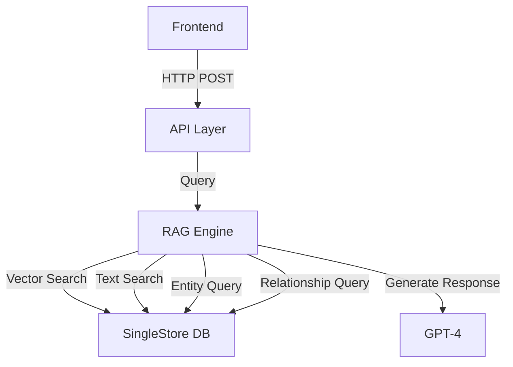

# SingleStore Knowledge Graph Search: Retrieval Flow

This document outlines the complete retrieval flow of the SingleStore Knowledge Graph Search system, from query input to response generation.

## High-Level Architecture



## Detailed Flow

### 1. Frontend Query Submission
**Location**: `frontend/components/SearchForm.tsx`
- Handles user query input
- Makes POST request to `/kag-search` endpoint
- Parameters:
  - query: string
  - top_k: number (default: 5)
  - debug: boolean

### 2. API Layer Processing
**Location**: `api.py`
- Endpoint: POST `/kag-search`
- Validates request using Pydantic models
- Initializes RAGQueryEngine
- Returns SearchResponse

### 3. Query Processing
**Location**: `rag_query.py:RAGQueryEngine.query()`
- Main orchestration method
- Coordinates all retrieval steps
- Handles result aggregation
- Manages error handling and logging

### 4. Embedding Generation
**Location**: `rag_query.py:RAGQueryEngine.get_query_embedding()`
- Uses OpenAI's text-embedding-ada-002 model
- Generates 1536-dimensional vector
- Handles API errors and retries

### 5. Vector Search
**Location**: `rag_query.py:RAGQueryEngine.vector_search()`
- Uses SingleStore's vector similarity search
- Computes cosine similarity with document embeddings
- Returns top-k most similar documents
- Optimized with HNSW index

### 6. Text Search
**Location**: `rag_query.py:RAGQueryEngine.text_search()`
- Utilizes SingleStore's full-text search
- Matches keywords and phrases
- Returns relevance-scored results

### 7. Result Merging
**Location**: `rag_query.py:RAGQueryEngine.merge_search_results()`
- Combines vector and text search results
- Normalizes scores (0 to 1 range)
- Weights: 70% vector, 30% text
- Returns unified ranked list

### 8. Entity Extraction
**Location**: `rag_query.py:RAGQueryEngine.get_entities_for_content()`
- Finds entities in retrieved content
- Queries Entities table
- Returns structured Entity objects
- Handles JSON parsing for aliases

### 9. Relationship Finding
**Location**: `rag_query.py:RAGQueryEngine.get_relationships()`
- Discovers entity relationships
- Queries Relationships table
- Returns structured Relationship objects
- Includes metadata and document references

### 10. Response Generation
**Location**: `rag_query.py:RAGQueryEngine.generate_response()`
- Uses GPT-4 for natural language generation
- Incorporates:
  - Document content
  - Entity information
  - Relationship context
- Returns formatted response

## Example Retrieval Flow

Let's walk through a complete example using the query "hello world" to understand how each component works together.

### 1. Initial Hybrid Search
```sql
-- Combines vector similarity with text relevance
SELECT 
    chunk_text,
    dot_product(chunk_embedding, query_embedding) as vector_score,
    MATCH(chunk_text) AGAINST('hello world') as text_score
FROM Document_Embeddings
ORDER BY (0.7 * vector_score + 0.3 * text_score) DESC
LIMIT 5;
```

Example results:
```python
chunks = [
    "Hello World is a common first program...",
    "The Hello World program originated in 1972...",
    "Brian Kernighan wrote about Hello World in the C Programming Language book...",
    "Java's Hello World example demonstrates object orientation...",
    "Python makes Hello World simple with print()..."
]
```

### 2. Entity Processing
The system analyzes both the query and retrieved chunks to identify entities:

- Extracted Entities:
  * "Hello World" (programming concept)
  * "Brian Kernighan" (person)
  * "C Programming Language" (programming language)
  * "Java" (programming language)
  * "Python" (programming language)

```sql
-- Entity Resolution Query
SELECT entity_id, name, category, metadata
FROM Entities
WHERE name IN ('Hello World', 'Brian Kernighan', 'C Programming Language', 'Java', 'Python');
```

### 3. Relationship Discovery
```sql
-- Find connections between entities
SELECT source_entity_id, target_entity_id, relation_type, metadata
FROM Relationships
WHERE source_entity_id IN (found_entity_ids)
OR target_entity_id IN (found_entity_ids);
```

Example relationships found:
- "Brian Kernighan" -> "created" -> "Hello World"
- "C Programming Language" -> "introduced" -> "Hello World"
- "Brian Kernighan" -> "authored" -> "C Programming Language"

### 4. Result Merging
The final context combines search results, entities, and relationships:

```python
final_results = {
    'search_results': [
        {
            'chunk_text': chunk,
            'relevance_score': score,
            'entities': [entities_in_chunk],
            'relationships': [relevant_relationships]
        }
        for chunk, score in search_results
    ],
    'entities': {
        'primary': ['Hello World'],  # From query
        'related': ['Brian Kernighan', 'C Programming Language']  # From context
    },
    'relationships': [
        {
            'source': 'Brian Kernighan',
            'relation': 'created',
            'target': 'Hello World',
            'confidence': 0.95
        }
        # ... more relationships
    ]
}
```

### 5. Final Context Assembly
The enriched context for LLM prompt generation:

```python
context = f"""
Relevant Information:
{top_chunks_with_scores}

Key Entities:
- Hello World (Programming Concept)
- Brian Kernighan (Person, Creator)

Important Relationships:
- Brian Kernighan created Hello World in 1972
- Hello World was first introduced in C Programming Language
"""
```

This example demonstrates how the system:
1. Combines vector and keyword search for initial retrieval
2. Enriches results with entity information
3. Adds relationship context
4. Assembles a comprehensive context for response generation

The final response will include not just the directly relevant text matches, but also broader context about entities and their relationships, providing a more complete and informative answer.

## Database Schema

Important Note: SingleStore does not support foreign keys. All references between tables (e.g., doc_id, entity_id) are logical and must be maintained at the application level.

### Document_Embeddings Table
```sql
CREATE TABLE Document_Embeddings (
    embedding_id BIGINT PRIMARY KEY AUTO_INCREMENT,
    doc_id BIGINT NOT NULL,        -- Logical reference to Documents.doc_id
    content TEXT,
    embedding VECTOR(1536),
    SORT KEY(),
    FULLTEXT USING VERSION 2 content_ft_idx (content),    -- Full-Text index (v2) on content
    VECTOR INDEX embedding_vec_idx (embedding)            -- Vector index on embedding column
        INDEX_OPTIONS '{ "index_type": "HNSW_FLAT", "metric_type": "DOT_PRODUCT" }'
);
```

### Documents Table
```sql
CREATE TABLE Documents (
    doc_id BIGINT PRIMARY KEY AUTO_INCREMENT,
    title VARCHAR(255),
    author VARCHAR(100),
    publish_date DATE,
    source JSON    -- Other metadata fields (e.g. summary, URL) stored as JSON
);
```

### Entities Table
```sql
CREATE TABLE Entities (
    entity_id BIGINT NOT NULL AUTO_INCREMENT,
    name VARCHAR(255) NOT NULL,
    description TEXT,
    aliases JSON,
    category VARCHAR(100),
    PRIMARY KEY (entity_id, name),    -- Composite primary key including shard key columns
    SHARD KEY (entity_id, name),      -- Enforce local uniqueness on shard key
    FULLTEXT USING VERSION 2 name_ft_idx (name)    -- Full-text index for name search
);
```

### Relationships Table
```sql
CREATE TABLE Relationships (
    relationship_id BIGINT PRIMARY KEY AUTO_INCREMENT,
    source_entity_id BIGINT NOT NULL,    -- Logical reference to Entities.entity_id
    target_entity_id BIGINT NOT NULL,    -- Logical reference to Entities.entity_id
    relation_type VARCHAR(100),
    doc_id BIGINT,                       -- Logical reference to Documents.doc_id
    KEY (source_entity_id) USING HASH,   -- Index for quickly finding relationships by source
    KEY (target_entity_id) USING HASH,   -- Index for quickly finding relationships by target
    KEY (doc_id)                         -- Index for querying relationships by document
);
```

### Key Design Considerations

1. **Referential Integrity**:
   - No foreign key constraints (SingleStore limitation)
   - Application code must maintain data consistency
   - Joins are performed without enforced relationships

2. **Indexing Strategy**:
   - HNSW_FLAT vector index for embeddings
   - FULLTEXT VERSION 2 for text search capabilities
   - HASH indexes for relationship lookups
   - Regular indexes for document references

3. **Performance Optimizations**:
   - Composite primary key in Entities table
   - Shard key for distributed data
   - Strategic index placement for common queries

## Technologies Used

### Backend
- Python 3.12.9
- FastAPI
- OpenAI API (embeddings + completion)
- SingleStore Python Client
- Pydantic for validation

### Frontend
- Next.js 14
- TypeScript
- Tailwind CSS
- React Hooks

### Database
- SingleStore
- HNSW Vector Index
- Full-Text Search V2

### AI Models
- OpenAI text-embedding-ada-002 (embeddings)
- GPT-4 (response generation)
- Gemini (semantic chunking)

## Environment Requirements
- OpenAI API key
- Gemini API key
- SingleStore credentials
- Python 3.12.9
- Node.js 18+

## Development Practices
- Comprehensive logging
- Error handling at all layers
- Pydantic validation
- Database connection management
- CORS configuration
- Mobile-responsive design
