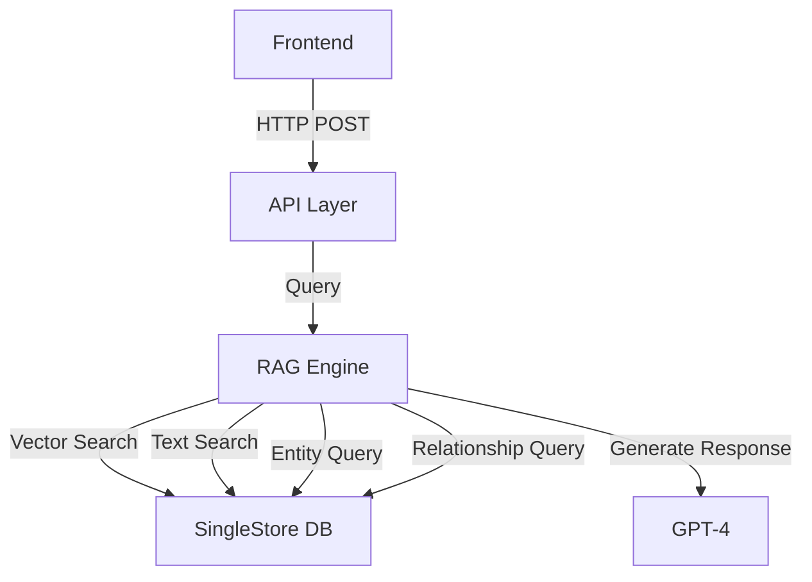

# SingleStore Knowledge Graph Search: Retrieval Flow

This document outlines the complete retrieval flow of the SingleStore Knowledge Graph Search system, from query input to response generation.

## High-Level Architecture

## Detailed Flow

### 1. Frontend Query Submission
**Location**: `frontend/components/SearchForm.tsx`
- Handles user query input
- Makes POST request to `/kag-search` endpoint
- Parameters:
  - query: string
  - top_k: number (default: 5)
  - debug: boolean

### 2. API Layer Processing
**Location**: `api.py`
- Endpoint: POST `/kag-search`
- Validates request using Pydantic models
- Initializes RAGQueryEngine
- Returns SearchResponse

### 3. Query Processing
**Location**: `rag_query.py:RAGQueryEngine.query()`
- Main orchestration method
- Coordinates all retrieval steps
- Handles result aggregation
- Manages error handling and logging

### 4. Embedding Generation
**Location**: `rag_query.py:RAGQueryEngine.get_query_embedding()`
- Uses OpenAI's text-embedding-ada-002 model
- Generates 1536-dimensional vector
- Handles API errors and retries

### 5. Vector Search
**Location**: `rag_query.py:RAGQueryEngine.vector_search()`
- Uses SingleStore's vector similarity search
- Computes cosine similarity with document embeddings
- Returns top-k most similar documents
- Optimized with HNSW index

### 6. Text Search
**Location**: `rag_query.py:RAGQueryEngine.text_search()`
- Utilizes SingleStore's full-text search
- Matches keywords and phrases
- Returns relevance-scored results

### 7. Result Merging
**Location**: `rag_query.py:RAGQueryEngine.merge_search_results()`
- Combines vector and text search results
- Normalizes scores (0 to 1 range)
- Weights: 70% vector, 30% text
- Returns unified ranked list

### 8. Entity Extraction
**Location**: `rag_query.py:RAGQueryEngine.get_entities_for_content()`
- Finds entities in retrieved content
- Queries Entities table
- Returns structured Entity objects
- Handles JSON parsing for aliases

### 9. Relationship Finding
**Location**: `rag_query.py:RAGQueryEngine.get_relationships()`
- Discovers entity relationships
- Queries Relationships table
- Returns structured Relationship objects
- Includes metadata and document references

### 10. Response Generation
**Location**: `rag_query.py:RAGQueryEngine.generate_response()`
- Uses GPT-4 for natural language generation
- Incorporates:
  - Document content
  - Entity information
  - Relationship context
- Returns formatted response

## Database Schema

### Document_Embeddings Table
- Stores document chunks
- Vector embeddings (HNSW index)
- Full-text search enabled

### Documents Table
- Document metadata
- Parent-child relationships
- Source information

### Entities Table
- Entity information
- Categories
- Descriptions
- Aliases (JSON array)

### Relationships Table
- Entity relationships
- Relationship types
- Document references
- Additional metadata

## Technologies Used

### Backend
- Python 3.12.9
- FastAPI
- OpenAI API (embeddings + completion)
- SingleStore Python Client
- Pydantic for validation

### Frontend
- Next.js 14
- TypeScript
- Tailwind CSS
- React Hooks

### Database
- SingleStore
- HNSW Vector Index
- Full-Text Search V2

### AI Models
- OpenAI text-embedding-ada-002 (embeddings)
- GPT-4 (response generation)
- Gemini (semantic chunking)

## Environment Requirements
- OpenAI API key
- Gemini API key
- SingleStore credentials
- Python 3.12.9
- Node.js 18+

## Development Practices
- Comprehensive logging
- Error handling at all layers
- Pydantic validation
- Database connection management
- CORS configuration
- Mobile-responsive design
